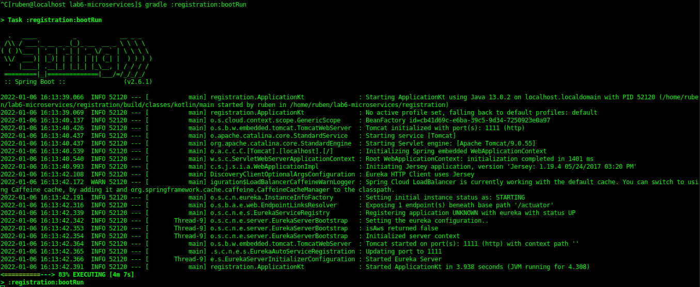
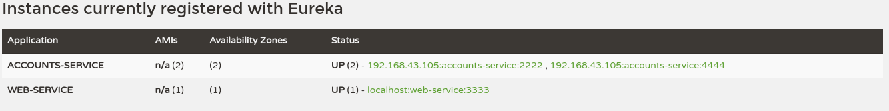

# Lab 6 - Main Goal

## Launching the services

For launching the registry service, we run the following command:

```
gradle :registration:bootRun
```


Screenshot 1: Running the registry

---

Then, we proceed launching the 'accounts' service:

```
gradle :accounts:bootRun
```


Screenshot 2: Running the accounts service on port 2222

---

Then we do the same with 'web' service:

```
gradle :web:bootRun
```


Screenshot 3: Running the web service on port 3333

---

Now, we can access via browser to see the services that are currently running and registered, via:

``` 
https://localhost:1111
```

Screenshot 4: Eureka Dashboard

---

Now we will run a second instance of the 'accounts' service. For that, we will just change the following line in the file '/accounts/src/main/resources/application.yml':

```
# HTTP Server
server:
  port: 2222   # HTTP (Tomcat) port
```

to

```
# HTTP Server
server:
  port: 4444   # HTTP (Tomcat) port
```

so this second instance will launch in port 4444 instead of 2222:


Screenshot 5: launching another accounts service on port 4444

And in the Eureka Dashboard we can check a second service is running, under a different port:


Screenshot 6: Eureka Dashboard showing the accounts services running on both 2222 and 4444 ports

---

If we kill the accounts service (2222) (via ctrl+C), and we refresh the Eureka website, it will notify that the service is 'DOWN'.:


Screenshot 7: Eureka shows that accounts service (2222) is down

However, after some time, the 2222 port service will stop showing in the Eureka site

---

After killing the accounts service, we can still retrieve info from the web service site:


Screenshot 8: Access Web Server

And we can try to fetch info from an account:


And it will still show the account details correctly, since the Web Server doesn't have a direct route to the accounts location. Instead, it uses a logical name which is translated by Eureka to its real name.